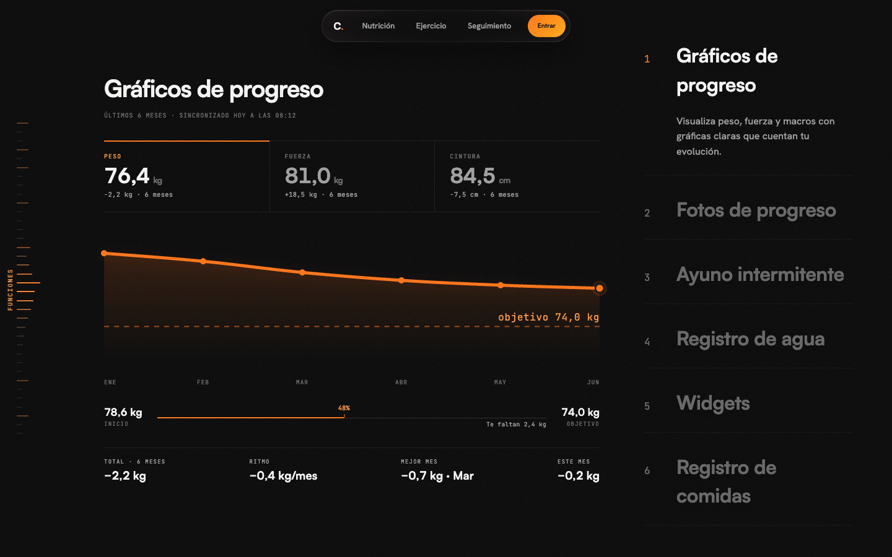

# Cofira

**Training, nutrition and progress tracking — one system.**


Cofira is a full-stack fitness platform: personalized training routines, AI-generated weekly meal plans and detailed progress tracking, in a single app with a cinematic dark-first interface.

**Live:** [cofira.kruhale.com](https://cofira.kruhale.com)


## Features

- **AI weekly meal plans** — 14-day menus generated through OpenRouter and streamed to the browser over SSE, with macros calculated per user profile, then persisted server-side.
- **Adaptive training routines** — weekly plans with per-exercise ✓/✗ feedback that feeds the next adjustment.
- **Progress tracking** — weight, strength and waist charts, progress photo timeline, water intake and intermittent fasting tools.
- **Cinematic landing** — GSAP + Lenis scroll choreography, WebGL particle scenes (Three.js) and an editorial design language driven by 500+ CSS design tokens.
- **Bilingual & themed** — full Spanish/English i18n and dark/light themes resolved entirely through semantic tokens.
- **Accessible by design** — WCAG-conscious markup, keyboard navigation, visible focus and complete `prefers-reduced-motion` coverage.
- **Auth & subscriptions** — JWT authentication, 14-step onboarding with calorie targets, and PRO gating validated against the backend on every route access.



## Tech stack

| Layer | Technology |
|---|---|
| Frontend | Angular 20 (standalone components, signals, zoneless), SCSS with ITCSS + flat BEM, GSAP + Lenis, Three.js |
| Backend | Spring Boot 4 (Java 21), REST + SSE, JWT, OpenRouter integration |
| Database | PostgreSQL 16 |
| Infra | Docker Compose, GitHub Actions CI/CD (tests gate the deploy) |

## Getting started

### Full stack with Docker (recommended)

```bash
git clone https://github.com/Kruhale/Cofira.git
cd Cofira
cp .env.example .env   # fill DB_PASSWORD, JWT_SECRET, OPENROUTER_API_KEY, PGADMIN_PASSWORD
docker-compose -f docker-compose-dev.yml up -d
```

| Service | URL |
|---|---|
| Frontend | http://localhost:4600 |
| Backend API | http://localhost:9002/api |
| PostgreSQL | localhost:6005 |
| pgAdmin | http://localhost:5051 |

`OPENROUTER_API_KEY` powers the AI generation of menus and routines; without it those features fail at runtime.

### Frontend only

```bash
cd cofira
npm install
npm start        # ng serve on :4200 (expects the API on :9002)
npm test         # Karma + Jasmine, headless Chrome
npm run build    # production build
```

### Backend only

```bash
cd backend
./gradlew test   # needs a PostgreSQL reachable via DB_URL (see src/test/resources)
./gradlew bootRun
```

## Project structure

```
Cofira/
├── cofira/            # Angular 20 frontend (standalone components + signals)
│   └── src/styles/    # ITCSS token system (00-settings … 07-dark-mode)
├── backend/           # Spring Boot 4 REST API (com.cofira)
├── docker-compose-dev.yml
├── docker-compose.yml # production
└── .github/workflows/ # CI/CD: backend + frontend tests, deploy on green
```

A live style guide documenting tokens and components is available at `/style-guide`.

## License

MIT — see [LICENSE](LICENSE).

Created by **Alejandro Bravo** ([@Kruhale](https://github.com/Kruhale)).
