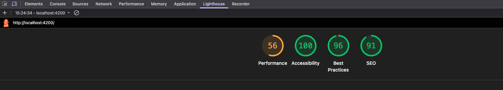
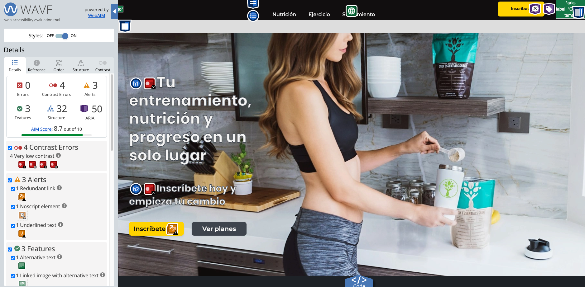
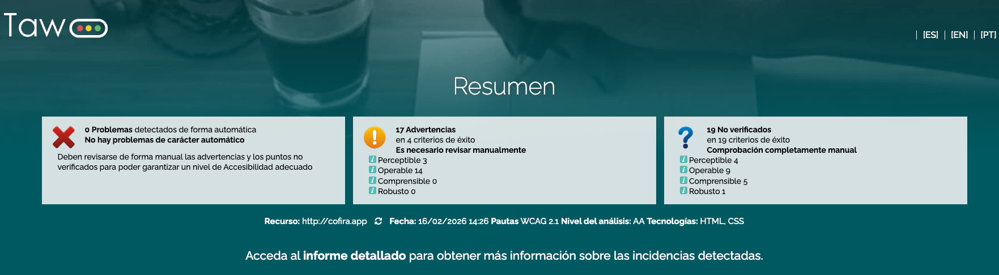
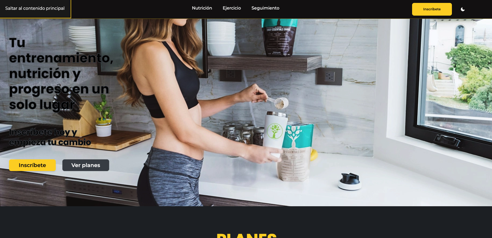
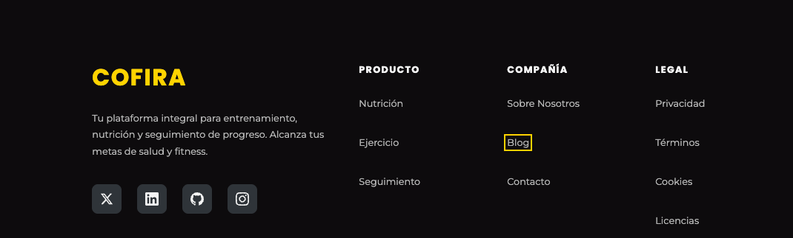
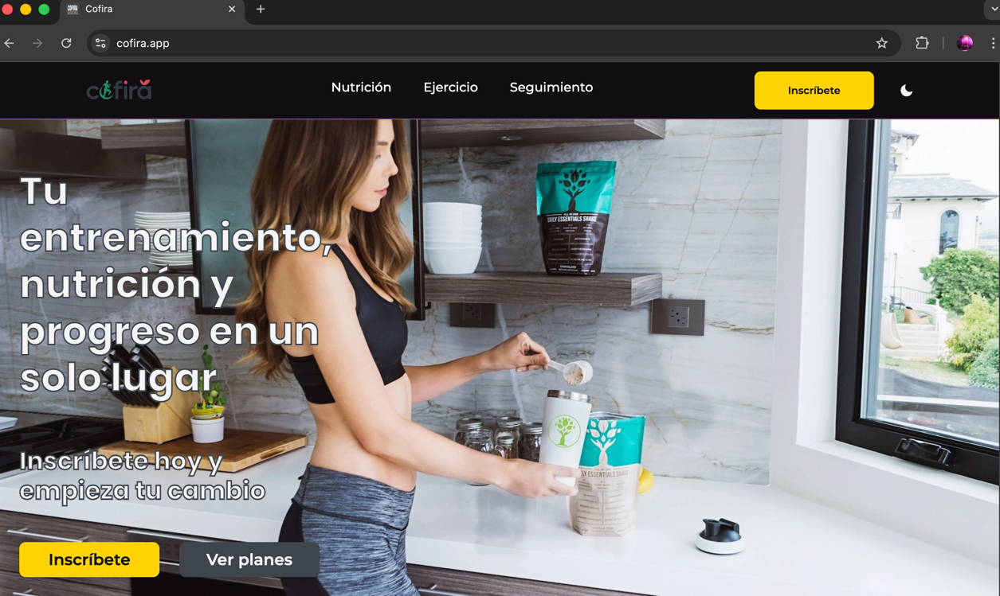
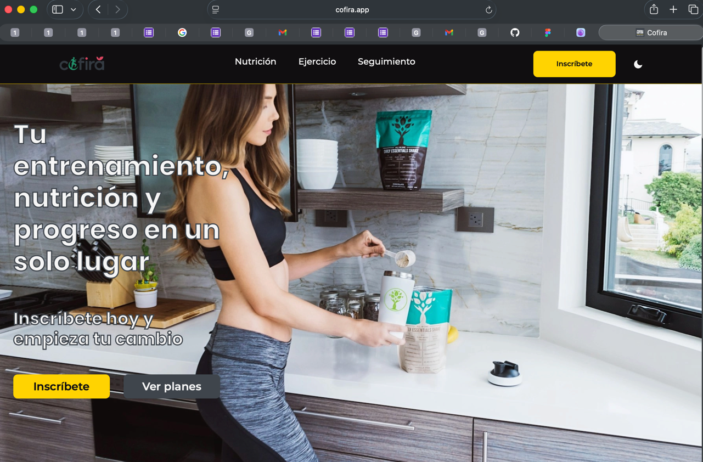
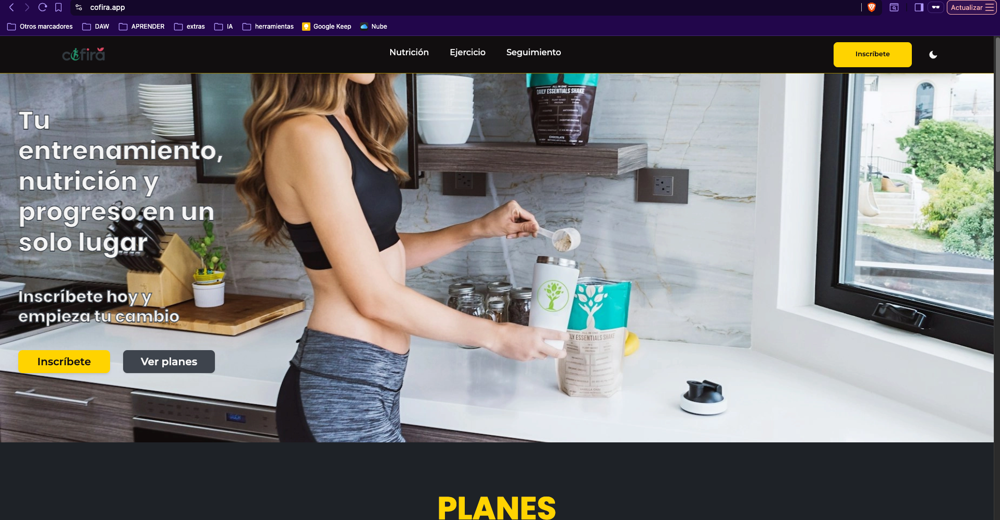
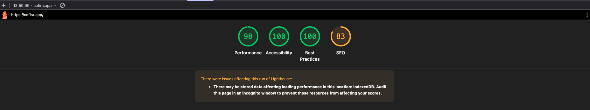
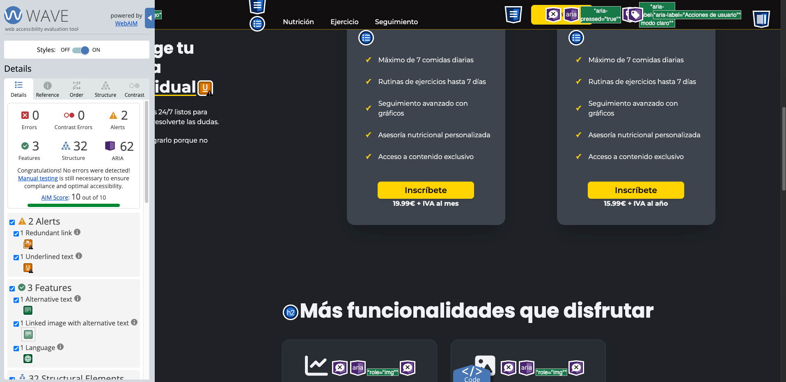

# Accesibilidad Web - Cofira


## Sección 1: Fundamentos de accesibilidad


### Por qué es necesaria la accesibilidad web

La accesibilidad web es hacer que tu web la pueda usar cualquiera, tenga discapacidad visual, auditiva, motora o cognitiva. Pero no es solo para personas con discapacidad, también ayuda a alguien que está usando el móvil con una mano o a alguien que está en un sitio ruidoso y necesita subtítulos. Además en España es obligatorio por ley cumplir WCAG 2.1 nivel AA como mínimo.


### Los 4 principios WCAG 2.1 (POUR)

1. **Perceptible:** La información tiene que poder percibirse facilmente.
   - Ejemplo: Las imágenes de mi galería en Sobre Nosotros tienen `alt` descriptivo para que un usuario ciego que use lector de pantalla sepa qué se ve en cada foto

2. **Operable:** Los componentes tienen que poder usarse con teclado y siguiendo un orden lógico
   - Ejemplo: Toda mi web se puede navegar usando solo el teclado con Tab y tengo un skip link que salta directamente al contenido principal

3. **Comprensible:** El contenido tiene que ser legible y predecible.
   - Ejemplo: Cada página tiene `lang="es"` y los errores de formularios explican qué falta exactamente

4. **Robusto:** Tiene que funcionar con tecnologías de asistencia y ser compatible con navegadores actuales y futuros.
   - Ejemplo: Los SVGs decorativos que uso como iconos llevan `aria-hidden="true"` para que VoiceOver anuncie si están activados o no.


### Niveles de conformidad

- **Nivel A** - Es lo mínimo. Si no lo cumples hay barreras muy graves como que las imágenes no tengan alt o que no se pueda navegar con teclado
- **Nivel AA** - Es el nivel que pide la ley española y es el que he buscado alcanzar en este proyecto
- **Nivel AAA** - Es el más estricto de todos. Es muy difícil cumplirlo al 100%

El objetivo de este proyecto es **nivel AA** porque es el que se exige legalmente.

### Recursos para consultar

- https://www.w3.org/WAI/fundamentals/accessibility-intro/es
- https://accesible.es

---

## Sección 2: Componente multimedia implementado

**Tipo:** Galería de imágenes

**Descripción:** He añadido una galería de 6 imágenes en la página Sobre Nosotros, entre las secciones de Historia y Valores. Muestra las instalaciones y actividades de Cofira como la zona de peso libre, zona cardiovascular, alimentación, clases grupales, zona de estiramientos y seguimiento de progreso. He elegido hacer una galería en vez de un vídeo o carrusel porque me parecía más sencillo de implementar de forma accesible.

**Características de accesibilidad:**

- Cada imagen tiene un `alt` descriptivo. No he puesto "imagen de..." porque los lectores de pantalla ya dicen que es una imagen, he descrito lo que se ve
- He usado `<figure>` con `<figcaption>` que es la forma semántica correcta de asociar una imagen con su pie de foto
- Las imágenes llevan `loading="lazy"` para que carguen solo cuando el usuario se acerca, mejora el rendimiento sin afectar a la accesibilidad
- He puesto `width` y `height` para evitar el layout shift que es cuando la página salta al cargar las imágenes

---

## Sección 3: Auditoría automatizada inicial

He pasado 3 herramientas de análisis ANTES de aplicar ninguna corrección:

| Herramienta | Puntuación/Errores | Captura |
|-------------|-------------------|---------|
| Lighthouse | 100/100 |  |
| WAVE | 0 errores, 3 alertas |  |
| TAW | 7 problemas |  |

### Los 3 problemas más graves

1. **Labels vacíos en el login** - Los inputs del login tenían `<label>` como wrapper pero sin asociación real y WAVE los marcaba como error. Los lectores de pantalla no anunciaban el nombre de cada campo.

2. **Contraste del skip link** - El skip link tenía un contraste muy bajo. Pasaba porque en `app.scss` tenía un selector `* { background-color }` que me sobreescribía el fondo del skip link.

3. **4 enlaces vacíos en el footer** - Los enlaces de redes sociales solo tenían un SVG sin texto ni `aria-label` y los lectores de pantalla los anunciaban como "enlace" a secas.

---

## Sección 4: Análisis y corrección de errores

### Tabla resumen

| # | Error | Criterio WCAG | Herramienta | Solución aplicada |
|---|-------|---------------|-------------|-------------------|
| 1 | Labels vacíos en login | 1.3.1 | WAVE, TAW | Cambié `<label>` por `<span>` y añadí `aria-label` a cada input |
| 2 | Contraste del skip link | 1.4.3 | TAW, Lighthouse | Cambié `*{}` por `:host{}` y puse colores de alto contraste |
| 3 | Enlaces vacíos en footer | 2.4.4 | WAVE, TAW | Añadí `aria-label` con el nombre de cada red social |
| 4 | Contraste en "Leer más" del blog | 1.4.3 | Lighthouse | Cambié el color a `--amarillo-texto-accesible` |
| 5 | Contraste en login modo oscuro | 1.4.3 | TAW | Cambié `--gris-normal` por `--text-secondary` |
| 6 | Título genérico en todas las páginas | 2.4.2 | TAW | Añadí `title` a cada ruta en `app.routes.ts` |
| 7 | HTML anidado inválido | 4.1.1 | TAW | Quité el `<html>` duplicado de `app.html` |

### Detalle de cada error

#### 1º Error: Labels vacíos en el formulario de login

**Problema:** Los inputs del login estaban envueltos en `<label>` pero sin texto asociado real y WAVE los detectaba como labels vacíos.

**Impacto:** Los lectores de pantalla no sabían qué campo era cada uno.

**Criterio WCAG:** 1.3.1 - Información y relaciones

**Código ANTES:**
```html
<label class="login__campo">
  <span class="login__campo-texto">Email</span>
  <input type="email" placeholder="Tu email">
</label>
```

**Código DESPUÉS:**
```html
<span class="login__campo">
  <span class="login__campo-texto">Email</span>
  <input aria-label="Email" type="email" placeholder="Tu email">
</span>
```

#### 2º Error: Contraste del skip link

**Problema:** El skip link tenía muy poco contraste porque en `app.scss` tenía un `* { background-color }` que aplicaba un fondo claro a TODO y me sobreescribía el fondo oscuro del skip link.

**Impacto:** El skip link era invisible al hacer focus con Tab.

**Criterio WCAG:** 1.4.3 - Contraste mínimo

**Código ANTES:**
```scss
* {
  background-color: var(--blanco-normal-hover);
}
```

**Código DESPUÉS:**
```scss
:host {
  background-color: var(--blanco-normal-hover);
}

.skip-link {
  background: var(--negro-normal);
  color: var(--blanco-normal);
}
```

#### 3º Error: Enlaces vacíos en el footer

**Problema:** Los enlaces de redes sociales del footer solo tenían un SVG sin texto ni `aria-label`.

**Impacto:** Los lectores de pantalla anunciaban "enlace" sin decir a dónde iba.

**Criterio WCAG:** 2.4.4 - Propósito de los enlaces

**Código ANTES:**
```html
<a class="pie__social" href="https://twitter.com" target="_blank">
  <svg class="pie__social-icono">...</svg>
</a>
```

**Código DESPUÉS:**
```html
<a aria-label="Twitter" class="pie__social" href="https://twitter.com" rel="noopener" target="_blank">
  <svg aria-hidden="true" class="pie__social-icono">...</svg>
  <span class="enlaces__arial-oculto">Twitter</span>
</a>
```

#### 4º Error: Contraste en los enlaces "Leer más" del blog

**Problema:** Los enlaces "Leer más" del blog tenían un color amarillo sobre fondo oscuro que no daba suficiente contraste.

**Impacto:** Usuarios con baja visión no podían leer bien los enlaces.

**Criterio WCAG:** 1.4.3 - Contraste mínimo

**Código ANTES:**
```scss
.blog__articulo-leer {
  color: var(--amarillo-normal);
}
```

**Código DESPUÉS:**
```scss
.blog__articulo-leer {
  color: var(--amarillo-texto-accesible);
}
```

#### 5º Error: Contraste en login en modo oscuro

**Problema:** El subtítulo y texto inferior del login usaban `--gris-normal` que en modo oscuro no daba suficiente contraste.

**Impacto:** Usuarios con baja visión no podían leer el texto secundario en modo oscuro.

**Criterio WCAG:** 1.4.3 - Contraste mínimo

**Código ANTES:**
```scss
.login__subtitulo {
  color: var(--gris-normal);
}
```

**Código DESPUÉS:**
```scss
.login__subtitulo {
  color: var(--text-secondary);
}
```

---

## Sección 5: Análisis de estructura semántica

### Landmarks HTML5 utilizados

He usado estos landmarks para que los lectores de pantalla puedan navegar por regiones:

- [x] `<header>` - Cabecera del sitio con logo y navegación
- [x] `<nav>` - Menú de navegación principal
- [x] `<main>` - Contenido principal. Lo tengo en `app.html` y el contenido cambia con `router-outlet`
- [x] `<article>` - Lo uso en las tarjetas del blog
- [x] `<section>` - Lo uso para separar bloques como historia, galería y valores
- [ ] `<aside>` - No lo uso como sidebar pero sí para alertas con `role="alert"`
- [x] `<footer>` - Pie de página con redes sociales, idioma y tema

### Jerarquía de encabezados

Ejemplo de la Home:

```
H1: Cofira - Tu compañero de fitness
  H2: Nuestros servicios
    H3: Entrenamiento personalizado
    H3: Nutrición inteligente
    H3: Seguimiento de progreso
  H2: Testimonios
  H2: Preguntas frecuentes
```

La jerarquía es correcta, no hay saltos de nivel y cada página tiene un solo `<h1>`.

### Análisis de imágenes

- Total de imágenes: 6 (las de la galería en Sobre Nosotros)
- Con texto alternativo: 6
- Decorativas (alt=""): 0
- Sin alt (corregidas): 0

Todas las imágenes de contenido tienen `alt` descriptivo. Los iconos SVG que uso de forma decorativa llevan `aria-hidden="true"` para que los lectores de pantalla los ignoren.

---

## Sección 6: Verificación manual

### 6.1 Test de navegación por teclado

Desconecté el ratón y navegué toda la web solo con teclado:

- [x] Llego a todos los enlaces y botones con Tab
- [x] El orden con Tab es lógico, no salta de un sitio a otro
- [x] Se ve claramente qué elemento tiene el focus
- [x] Puedo usar la galería solo con teclado
- [x] No hay trampas de teclado
- [x] Los modales se cierran con Escape

**Problemas encontrados:** Ninguno.

**Soluciones aplicadas:** No hizo falta, todo funcionaba.





### 6.2 Test con lector de pantalla

**Herramienta:** VoiceOver en macOS (Cmd+F5)

| Aspecto evaluado | Resultado | Observación |
|------------------|-----------|-------------|
| Se entiende la estructura sin ver la pantalla | Sí | Los landmarks se anuncian bien |
| Los landmarks se anuncian correctamente | Sí | Anuncia "banner", "navegación", "contenido principal", "pie de página" |
| Las imágenes tienen descripciones adecuadas | Sí | Las imágenes se leen con su alt |
| Los enlaces tienen textos descriptivos | Sí | Los enlaces sociales anuncian el nombre de la red social |
| El componente multimedia es accesible | Sí | La galería funciona bien con el teclado |

**Principales problemas detectados:** Ninguno.

**Mejoras aplicadas:** No hizo falta.

### 6.3 Verificación cross-browser

He probado la web en 3 navegadores:

| Navegador | Versión | Layout correcto | Multimedia funciona | Observaciones |
|-----------|---------|-----------------|---------------------|---------------|
| Chrome | Última | Sí | Sí | Sin problemas |
| Safari | Última | Sí | Sí | Sin problemas |
| Brave | Última | Sí | Sí | Sin problemas |

En los tres he comprobado que el skip link funciona, el focus se ve bien y la galería carga con lazy loading.







---

## Sección 7: Resultados finales después de correcciones

Después de aplicar todas las correcciones volví a pasar las 3 herramientas:

| Herramienta | Antes | Después | Mejora |
|-------------|-------|---------|--------|
| Lighthouse | 100/100 | 100/100 | +0 puntos |
| WAVE | 0 errores, 3 alertas | 0 errores | -3 alertas |
| TAW | 7 problemas | 0 problemas | -7 problemas |





### Checklist de conformidad WCAG 2.1 Nivel AA

**Perceptible:**
- [x] 1.1.1 - Contenido no textual (alt en imágenes)
- [x] 1.3.1 - Información y relaciones (HTML semántico)
- [x] 1.4.3 - Contraste mínimo (4.5:1 en texto normal)
- [x] 1.4.4 - Redimensionar texto (200% sin scroll horizontal)

**Operable:**
- [x] 2.1.1 - Teclado (todo accesible)
- [x] 2.1.2 - Sin trampas de teclado
- [x] 2.4.3 - Orden del foco lógico
- [x] 2.4.7 - Foco visible

**Comprensible:**
- [x] 3.1.1 - Idioma de la página (lang="es")
- [x] 3.2.3 - Navegación consistente
- [x] 3.3.2 - Etiquetas en formularios

**Robusto:**
- [x] 4.1.2 - Nombre, función, valor (ARIA cuando hace falta)

### Nivel de conformidad alcanzado

**Nivel AA.**

Todos los criterios se cumplen en las páginas públicas. Las páginas protegidas (alimentación, gimnasio, seguimiento) no las he podido testear con herramientas automáticas porque necesitan autenticación, pero usan los mismos componentes que el resto.

---

## Sección 8: Conclusiones y reflexión

### Es accesible mi proyecto

Pues después de todo el trabajo creo que sí. Lighthouse da 100/100 en todas las páginas, WAVE no detecta errores y la navegación con teclado y VoiceOver funciona bien. Lo que más me ha sorprendido ha sido probar con VoiceOver ya que las herramientas automáticas solo pillan un 30-40% de los problemas y sin el testing manual no habría encontrado cosas que las herramientas no detectan. Lo más complicado fue lo del contraste del skip link porque el problema no estaba en el skip link sino en un `*{}` que le sobreescribía los estilos y tardé un rato en encontrarlo. Ahora cuando desarrollo pienso en la accesibilidad desde el principio en vez de verlo como un parche al final.

### Principales mejoras aplicadas

1. **Skip link con contraste correcto** - Era invisible. Ahora tiene blanco sobre negro y es imprescindible para usuarios de teclado

2. **aria-label en enlaces de iconos** - Los lectores de pantalla ahora anuncian "Twitter, enlace" en vez de "enlace" a secas

3. **Labels en el login** - Cambié la estructura para que cada input tenga su `aria-label`

4. **Contraste en modo oscuro** - Usé variables semánticas que se adaptan al tema en vez de colores fijos

5. **Títulos por página** - Cada ruta tiene su `title` propio en vez del genérico "Cofira"

### Mejoras futuras

1. Testear las páginas protegidas con herramientas automáticas
2. Añadir `prefers-reduced-motion` para desactivar animaciones
3. Hacer que el `aria-label` del botón de idiomas coincida con el texto visible

### Aprendizaje clave

La verdad esque he aprendiendo que la accesibilidad es mejor tenerla en cuenta desde el principio porque como no lo hagas desde el principio pues tienes que hacer demasiados cambios que posiblemente no te gusten o que tardases mucho tiempo para cambiarlo. Si lo volviera a hacer lo haría desde el principio para no tener que hacer cambios tan grandes al final. Además, me ha sorprendido lo fácil que es hacer una web accesible si sigues las pautas de WCAG y usas HTML semántico. No es tan difícil como pensaba y el resultado es una web que puede usar cualquiera y facil de cambiar a futuro.